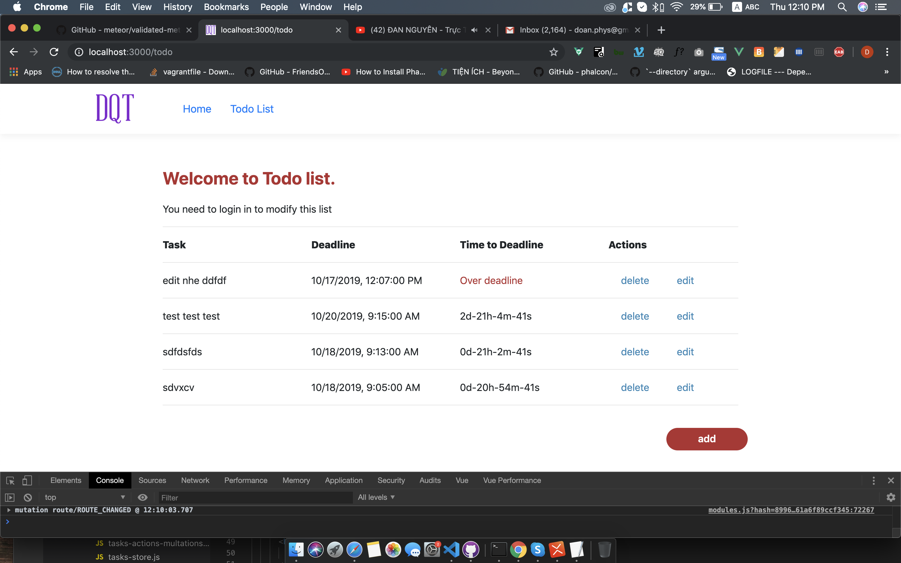
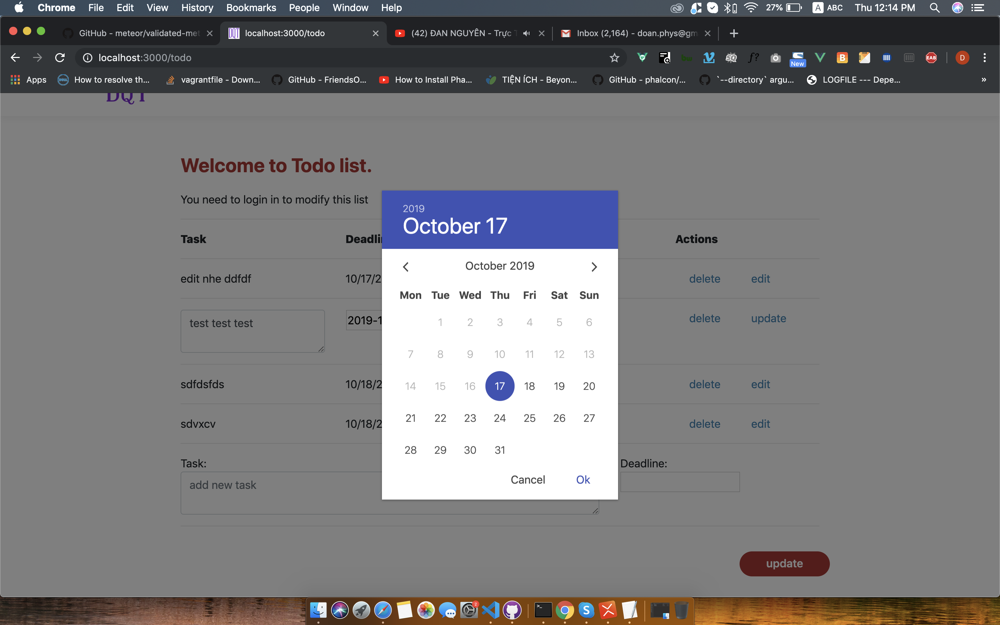
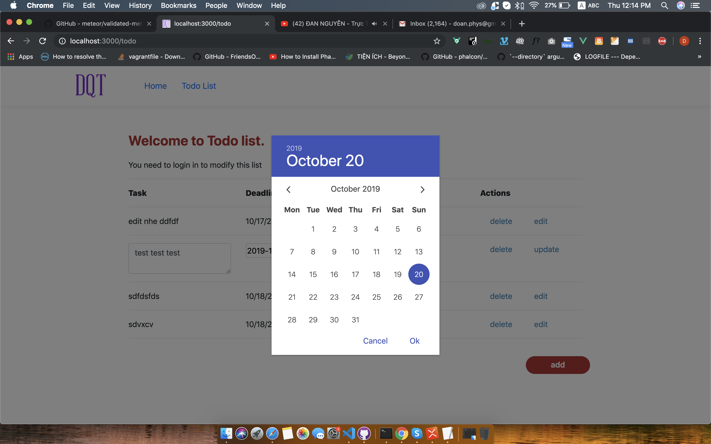
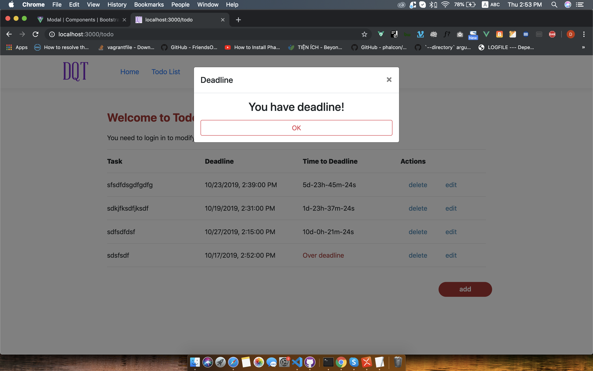

@ -0,0 +1,2 @@
# meteor_vue_todolist
Demo of reactive todo list using Meteorjs + Vuejs + mongoldb

1. Install meteorjs:
    curl https://install.meteor.com/ | sh
    (see guide on https://www.meteor.com/install)

2. create data:
    run script createTasksCollection.js in order to create tasks collections in mongodb data base, go to folder private/db_script and run:
        mongo  createTasksCollection.js
    the tasks collection will be created on local mongodb database: 127.0.0.1:27017/demo

3. start code Meteor + vuejs, run:
    meteor reset
    meteor npm i
    meteor npm run start

4. go to localhost:3000 to display web.

5. Deploy: 
    - you need to create database on host
    - Using meteor deploy to deploy code to galaxy (see guide on meteor.com)
    - or, build code to nodejs code then deploy it on AWS

Attention!, the code with meteorjs is quite heavy, so, it run quickly on MacBook Pro, but on macbook Air it's litle bit slow, 
and on Window, very very slow (new things are not design for old marchine! ).

enjoy!

Doan Quang Tuyen.

Screen capture of demo:
-----------------------------

Layout:

Add new task:

Edit: 

Show deadline in real time: 

